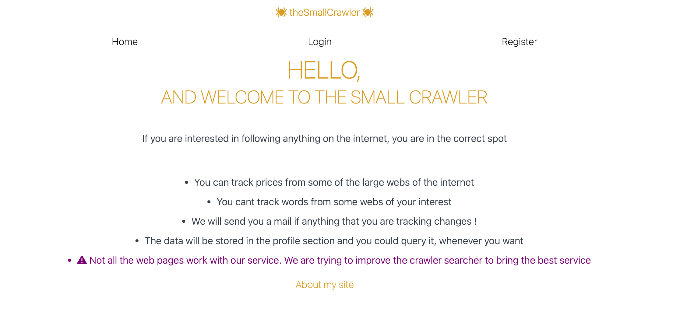
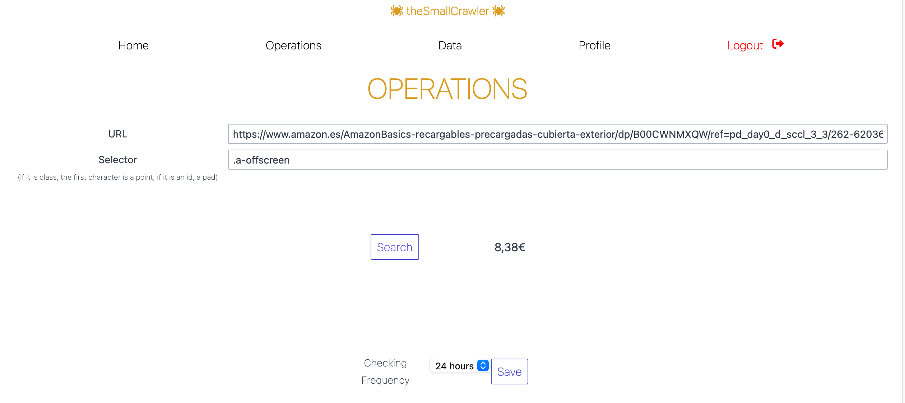
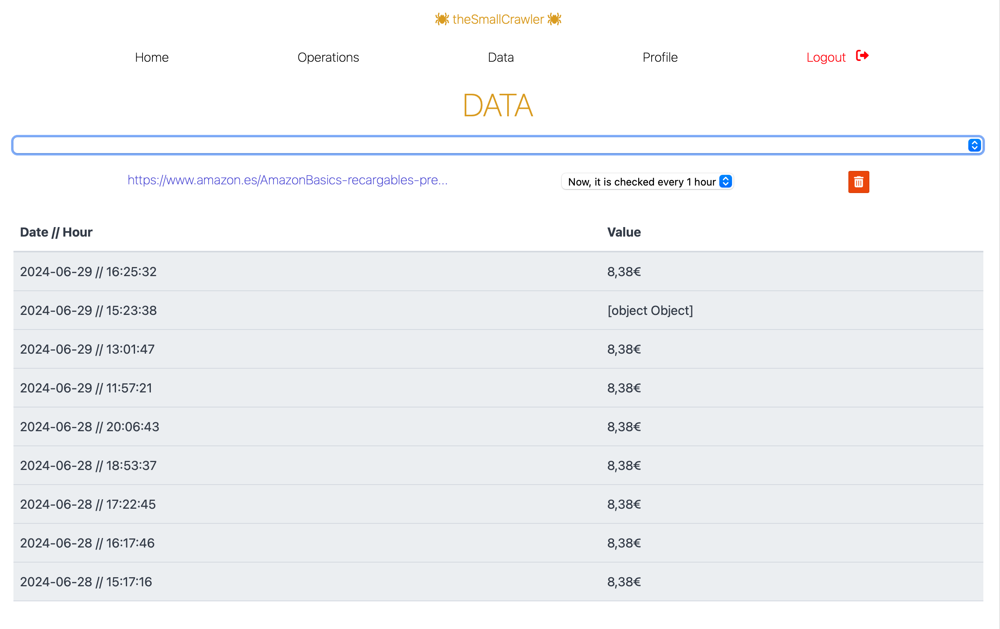
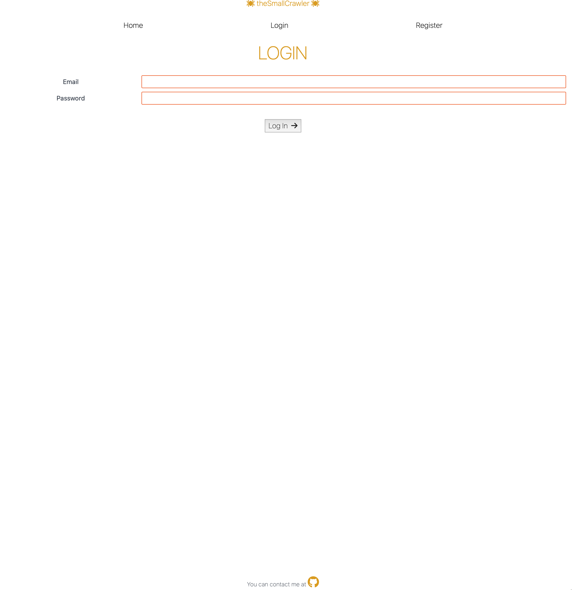
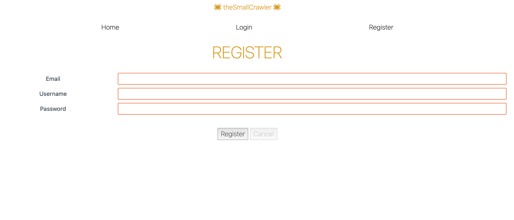
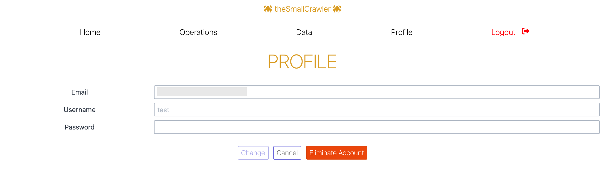
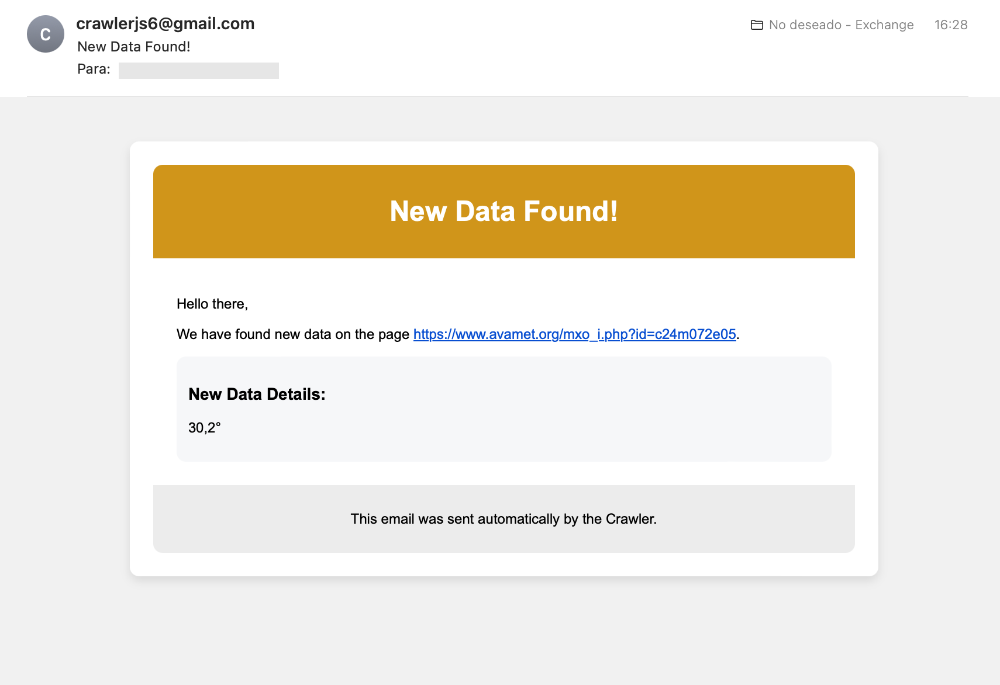

# The Small Crawler

## Descripción

Este es un proyecto personal que consiste en un backend con Express y MongoDB, y un frontend con Svelte. La aplicación es un rastreador web (crawler) que permite proporcionar una URL y un selector CSS. El programa revisa la URL y detecta si hay cambios en el contenido especificado por el selector.



## Funcionalidades

### 1. Añadir una URL y un selector CSS

Los usuarios pueden ingresar una URL y un selector CSS para monitorear cambios en elementos específicos de la página web.



### 2. Gestion de cambios

El sistema revisa periódicamente la URL proporcionada y compara el contenido del selector CSS. Permitiendo a cada usuario gestionar sus propias URLs y selectores.



### 3. Gestión de usuarios

Incluye Registro, Login, Gestion del Perfil





### 4. Notificaciones por correo

Los usuarios reciben notificaciones por correo electrónico cuando se detectan cambios en el contenido monitoreado.



## Backend

### Configuración

Debes proporcionar un archivo `.env` con las siguientes variables:

- `MONGO_URI`: URI de conexión a tu base de datos MongoDB.
- `SECRET`: Secreto utilizado para la creación de tokens JWT.
- `SALT_ROUNDS`: Número de rondas para el hashing de contraseñas.
- `PORT`: Puerto en el que correrá el servidor.
- `MAIL_USERNAME`: Nombre de usuario para el servicio de correo (Gmail).
- `MAIL_CLIENT_ID`: ID del cliente para el servicio de correo (Gmail).
- `MAIL_CLIENT_SECRET`: Secreto del cliente para el servicio de correo (Gmail).
- `MAIL_REFRESH_TOKEN`: Token de refresco para el servicio de correo (Gmail).

### Iniciar el servidor

Para iniciar el servidor backend, usa el siguiente comando:

```sh
npm run start
```

## Frontend

### Iniciar el desarrollo

Para iniciar el entorno de desarrollo del frontend, usa el siguiente comando:

```sh
npm run start
```

## Pruebas End-to-End con Cypress

Para ejecutar pruebas e2e (end-to-end) con Cypress, sigue estos pasos:

1. Entra en el directorio del frontend:

   ```sh
   cd path/to/frontend
   ```

2. Inicia las pruebas con el siguiente comando, que ejecutará ambos servidores y Cypress:

   ```sh
   npm run test
   ```

## Pruebas con Vitest (Backend)

Para ejecutar las pruebas unitarias en el backend con Vitest, usa el siguiente comando:

```sh
npm run vitest
```
